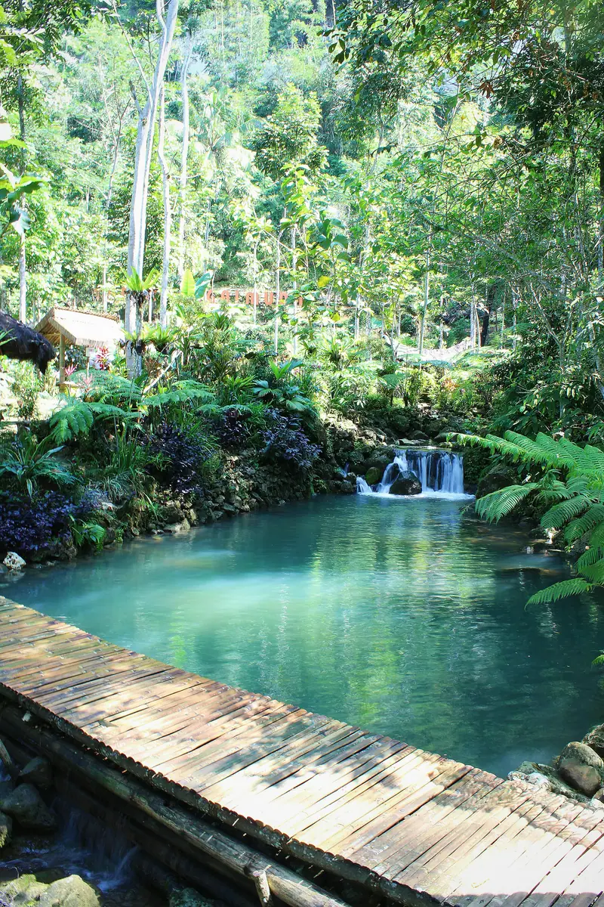
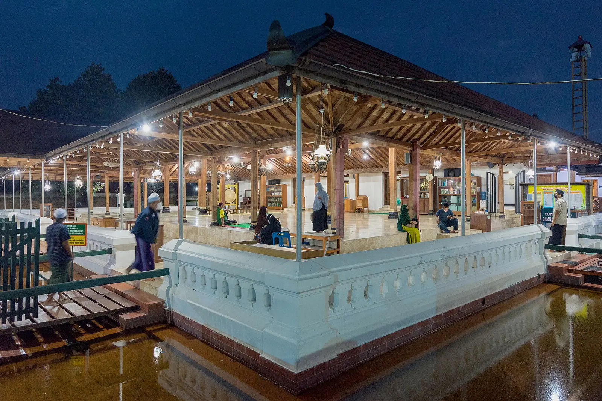
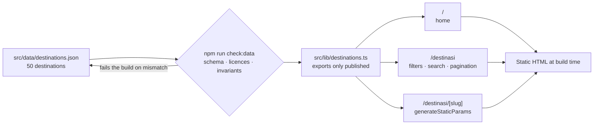

<div align="center">


# HolidayIn

**A tourism guide to the Special Region of Yogyakarta, Indonesia.**

A college assignment — static HTML/CSS/vanilla JS with three procedural PHP
scripts on MySQL — rebuilt from scratch in Next.js as a portfolio project.

[](https://nextjs.org)
[](https://react.dev)
[](https://www.typescriptlang.org)
[](https://tailwindcss.com)


**Live demo:** _not deployed yet_

</div>

---

<table>
<tr>
<td width="33%"></td>
<td width="33%"></td>
<td width="33%"></td>
</tr>
<tr>
<td align="center"><b>Keraton Ratu Boko</b><br><sub>Sleman · Budaya & Sejarah</sub></td>
<td align="center"><b>Hutan Pinus Mangunan</b><br><sub>Bantul · Alam & Perbukitan</sub></td>
<td align="center"><b>Pantai Ngobaran</b><br><sub>Gunungkidul · Pantai</sub></td>
</tr>
<tr>
<td></td>
<td></td>
<td></td>
</tr>
<tr>
<td align="center"><b>Kampung Batik Giriloyo</b><br><sub>Bantul · Desa Wisata & Kerajinan</sub></td>
<td align="center"><b>Taman Sungai Mudal</b><br><sub>Kulon Progo · Alam & Perbukitan</sub></td>
<td align="center"><b>Kampung Wisata Kotagede</b><br><sub>Kota Yogyakarta · Desa Wisata & Kerajinan</sub></td>
</tr>
</table>

<sub>Photos, left to right: M Yusril Mirza (CC BY-SA 4.0) · Aqilla Rahmi (CC BY 4.0) ·
Erlyndita Setyawardani dan Fandy Aprianto Rohman (CC BY-SA 4.0) · Aconkyeah (CC BY-SA 4.0) ·
Stella Nostra G. A (CC BY-SA 4.0) · Arry gunawan (CC BY-SA 4.0).
Full attribution for all 158 photos lives in
<a href="src/data/destinations.json"><code>destinations.json</code></a>.</sub>

---

## What it is

HolidayIn catalogues **50 destinations** across the five regencies of
Yogyakarta, each with a written description, opening hours, per-tariff ticket
prices, a map link, and licensed photography with full attribution.

The rebuild keeps the subject matter and discards the code. Twelve copy-pasted
detail pages collapsed into one dynamic route, placeholder content was replaced
with researched and sourced information, and the PHP layer was dropped rather
than ported. The original code is kept under [`/legacy`](legacy/) as content
reference only. All user-facing text is in Bahasa Indonesia.

| Destinations | Published | Regencies | Categories | Photos | Databases |
|:---:|:---:|:---:|:---:|:---:|:---:|
| **50** | **45** | **5** | **6** | **158** | **0** |

## Features

- **Real filtering.** Region, category, and full-text search across names, tags,
  and locations — all driven entirely by the URL, so any filtered view can be
  shared or bookmarked. The search form is a plain GET form, so it still works
  with JavaScript disabled.
- **Server-computed result counts** on every filter option, including the counts
  inside the mobile filter sheet as the selection changes.
- **Photo gallery** with keyboard and swipe navigation, and per-photo attribution.
- **Practical-information card** covering opening hours, ticket prices split by
  visitor type (domestic/foreign) and day (weekday/weekend), notes, and a map
  link. Any field without a trustworthy value is hidden rather than shown as a
  placeholder `-` or `N/A`.
- **Statically generated** detail pages — every destination is built at compile
  time.
- **Light and dark themes** driven by system preference.
- **A living style guide** at `/styleguide` rendering every colour token with its
  live WCAG contrast ratio against the background of each mode.

## Tech stack

| | |
|---|---|
| **Framework** | Next.js 16.3 — App Router, React Server Components, Turbopack |
| **UI** | React 19.2, TypeScript 5 (strict) |
| **Styling** | Tailwind CSS v4, configured entirely through CSS theme tokens |
| **Icons** | lucide-react |
| **Content** | A versioned JSON file validated by a Node script — no database, no CMS |

## Architecture

One JSON file is the single source of truth. A validator gates it, one module
filters it, and every page reads from that module — so the "don't show
unpublished destinations" rule is enforced in exactly one place instead of in
each consumer.



```
app/
  page.tsx                  home — hero, featured, regions, categories
  destinasi/page.tsx        list — URL-driven filters, search, pagination
  destinasi/[slug]/page.tsx detail — statically generated per destination
  styleguide/page.tsx       colour tokens with live contrast ratios
  not-found.tsx             404
  globals.css               Tailwind v4 theme tokens

src/
  data/destinations.json    content, sources, licences, lastVerified
  data/events.json          extracted, not yet routed (phase 2)
  lib/destinations.ts       types + the published filter, in one place
  lib/taxonomy.ts           region and category labels
  lib/tokens.ts             colour tokens shared with the style guide
  components/               18 components, server-first

scripts/
  check-destinations.mjs    the validator behind npm run check:data

legacy/                     the original project, reference only
```

## Routes

| Route | Description |
|---|---|
| `/` | Home — hero, featured destinations, regions, categories |
| `/destinasi` | All destinations with filters, search, and pagination |
| `/destinasi/[slug]` | Detail page, statically generated per destination |
| `/styleguide` | Colour tokens with live contrast ratios |

## Design

The palette is drawn from Yogyakarta itself: *sogan* batik brown, Merapi
andesite grey, and kraton gold.


`highlight` is the kraton gold, and it is deliberately **never** used as a text
colour: at 2.84:1 on the paper background it fails AA for body text and even the
3:1 large-text floor. It is reserved for rules, icons, borders, and decorative
detail. That constraint is why `/styleguide` exists — it renders every token
with its live contrast ratio in both modes, so a new pairing gets checked before
it ships rather than after.

## Data model

Every destination is one object. Nothing is hardcoded in a component.

```jsonc
{
  "slug": "candi-prambanan",
  "name": "Candi Prambanan",
  "region": "sleman",
  "category": "budaya",
  "published": true,          // true iff a licensed card photo exists
  "info": {
    "openingHours": "07.00 - 17.30",
    "ticket": {
      "currency": "IDR",
      "rates": [               // one row per tariff, so weekday/weekend shows
        { "visitor": "local",   "day": "weekday", "min": 50000,  "max": 50000  },
        { "visitor": "local",   "day": "weekend", "min": 65000,  "max": 65000  },
        { "visitor": "foreign", "day": "all",     "min": 400000, "max": 400000 }
      ]
    },
    "notes": "Zona utama candi tutup setiap Senin untuk perawatan."
  },
  "location": { "lat": -7.75222, "lng": 110.49167, "mapsUrl": "…" },
  "needsVerification": ["info.openingHours"],   // value present but not trusted
  "lastVerified": "2026-09-18"
}
```

Three conventions do most of the work:

- **`null` means "not available."** The UI hides that row entirely — no `-`, no
  `N/A`, no empty label.
- **`needsVerification`** lists fields that *have* a value that isn't trusted yet
  (dated or conflicting sources). It is not a list of empty fields.
- **`published`** must be true exactly when a card photo exists, and unpublished
  destinations are filtered out in one module. The validator fails on any
  mismatch, so the two can't drift apart.

## Data and photo sourcing

Each destination carries its source URLs and a `lastVerified` date, which the
detail page surfaces as "Info diperbarui &lt;month year&gt;". Twelve destinations
originate from the legacy site; the other 38 were added by research.

Photo licensing is enforced, not assumed:

- Sources are limited to Wikimedia Commons, Unsplash, Openverse, Flickr, and Pexels.
- Licences are limited to CC0, CC BY, CC BY-SA, or public domain — NonCommercial
  and NoDerivatives are rejected.
- Each photo records its author, source URL, licence, and licence URL.
- Files are re-encoded to WebP at a maximum of 1600×1200.
- A handful of photos inherited from the legacy project have unknown provenance
  and are recorded as such.

A destination is only published if it has an acceptable photo — a generic stock
image that merely matches the keyword is treated as worse than none. The
published/photo invariant, the host allowlist, and the licence rules are all
enforced by `npm run check:data`, which fails on any mismatch.

## What changed from the legacy version

<details>
<summary><b>Twelve duplicated HTML files became one dynamic route</b></summary>

`det*.html` were copy-paste clones of each other; adding a destination meant
duplicating a file, swapping the images and text, and hand-editing a card into
the list page. They are now a single `/destinasi/[slug]` route rendered from
data, so adding a destination is a JSON entry.

</details>

<details>
<summary><b>Pagination that never worked was replaced with real filtering</b></summary>

The legacy pagination only toggled an `.active` CSS class, and the list was
hand-split across `des1.html` and `des2.html`. It was also unreachable code: the
shared `Js/index.js` threw on list pages before execution ever reached the
pagination handlers. The rebuild has working region and category filters, text
search across names, tags, and locations, and real pagination.

</details>

<details>
<summary><b>The PHP layer was removed rather than ported</b></summary>

Both queries in `login.php` and `Registrasi.php` interpolated `$_POST` values
straight into SQL, which is a SQL injection hole. Login also set no session, so
nothing was actually gated. The site is now fully static with no database, and
authentication is deferred until it can be built properly.

</details>

<details>
<summary><b>Lorem ipsum was replaced with researched content</b></summary>

All twelve legacy detail pages shared the same placeholder description and the
same copy-pasted opening hours and prices. Every description was rewritten, and
hours, prices, and coordinates were researched per destination, each with source
URLs and a verification date.

</details>

## Lighthouse

Measured with Lighthouse 13.5 against a production build (`next build` +
`next start`) on localhost, desktop preset with simulated throttling. Numbers
from a deployed host will differ.

| Page | Performance | Accessibility | Best Practices | SEO | LCP | CLS |
|---|---|---|---|---|---|---|
| `/` | 97 | 100 | 100 | 100 | 1.3 s | 0 |
| `/destinasi` | 100 | 96 | 100 | 100 | 0.7 s | 0 |
| `/destinasi/[slug]` | 99 | 100 | 100 | 100 | 0.8 s | 0 |

The accessibility score on `/destinasi` is a known contrast failure on two
low-emphasis elements: the count inside an active filter pill, and the disabled
pagination buttons. Both are queued in the roadmap below.

## Running locally

```bash
npm install
npm run dev          # http://localhost:3000
```

| Script | What it does |
|---|---|
| `npm run dev` | Development server |
| `npm run build` | Production build |
| `npm run lint` | ESLint |
| `npm run check:data` | Validates the destination schema, photo sources and licences, and the published/photo invariant |

## Roadmap

**Phase 1 polish, still open**

- [ ] Fix the two contrast failures above, and raise the light-mode `muted` and
      `accent` tokens, which fall just below AA when used on the `surface`
      background rather than on the page background.
- [ ] Per-page canonical URLs, `sitemap.ts`, and `robots.ts`.
- [ ] Dynamic Open Graph images per destination.
- [ ] A `/kredit-foto` page listing every photo with its author, source, and licence.

**Phase 2**

- [ ] **Events.** Content is already extracted into `src/data/events.json`; no
      routes are built yet.
- [ ] **Reviews.** The detail page reserves a slot for a review section, which
      needs a backend to be worth building.
- [ ] **Accounts.** Login and profile were deliberately not ported. If they
      return, it will be with prepared statements, real sessions, and gated routes.
